# Library Management System

Project for OOP UET: Library Management System

## Team Members
- Dương Thái Trân - 23020712
- Nguyễn Đình Văn - 23020714
- Đặng Đình Khang - 23020675
- Nguyễn Thành Minh - 23020684

# Giới thiệu
- Ứng dụng quản lí thư viện dùng để quản lí tài liệu và người dùng trong thư viện.
- Được viết bằng ngôn ngữ Java và hỗ trợ bởi thư viện JavaFX và Sence Builder để tạo ra giao diện đồ hoạ thú vị, đẹp mắt.

## Table of contents
- [Chức năng](#Chức-năng)
  - [Admin](#Admin)
    - [Quản lý tài liệu](#Quản-lý-tài-liệu)
    - [Quản lý sinh viên](#Quản-lý-sinh-viên)
    - [Quản lý giao dịch của sinh viên](#Quản-lý-giao-dịch-của-sinh-viên)
  - [Student](#Student)
    - [Mượn, trả tài liệu](#Mượn-trả-tài-liệu)
    - [Quản lý giao dịch của mình](#Quản-lý-giao-dịch-của-mình)
- [Công nghệ sử dụng](#Công-nghệ-sử-dụng)
  - [JavaFX, Scene Builer](#JavaFX-Scene-Builer)
  - [Google Books API](#Google-Books-API)
  - [Goole Gmail API](#Google-Gmail-API)
  - [PDF](#PDF)
  - [SQLite](#SQLite)

# Chức năng
Các tính năng mà ứng dụng sẽ hỗ trợ.

2 trang đăng nhập riêng biệt :
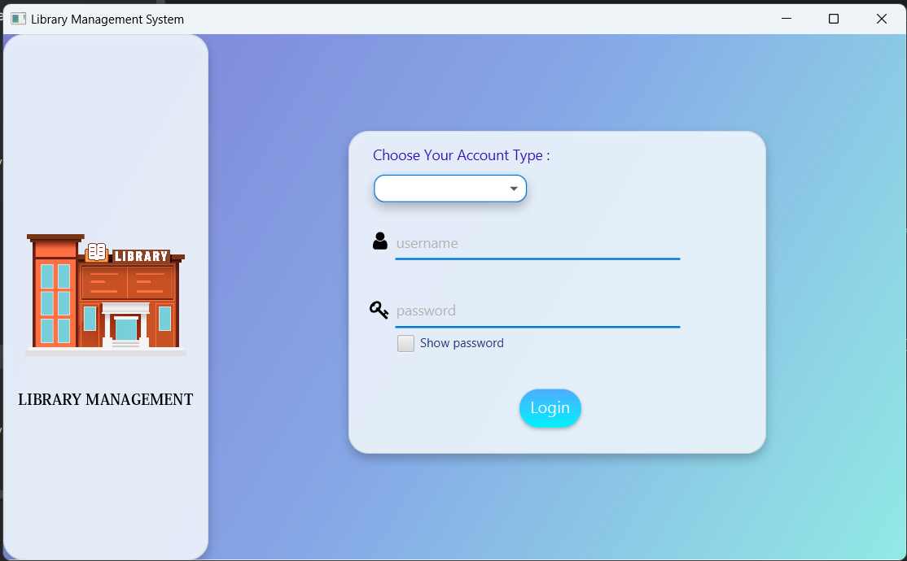
## Admin

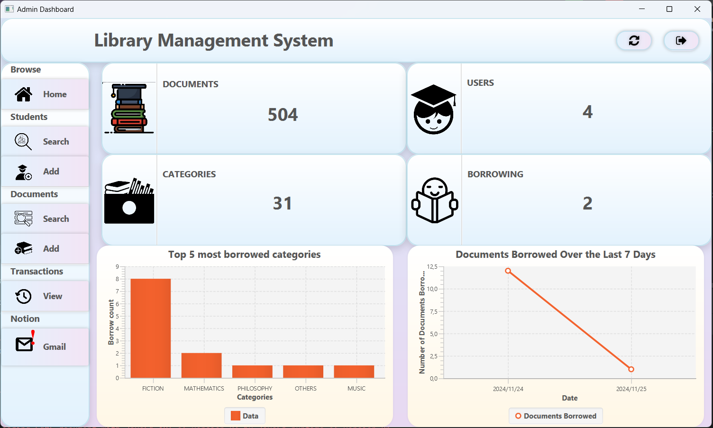

### Quản lý tài liệu
- Tìm kiếm and Delete:

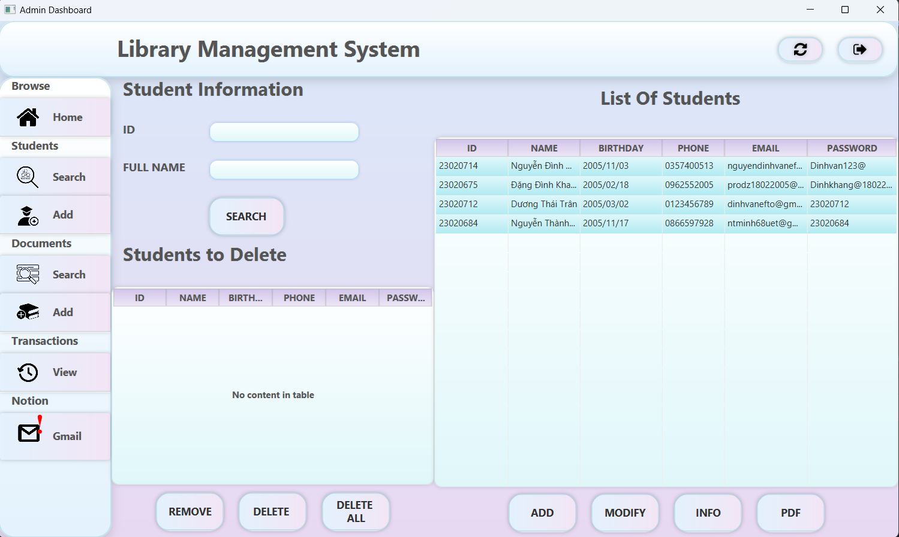
- Thêm:

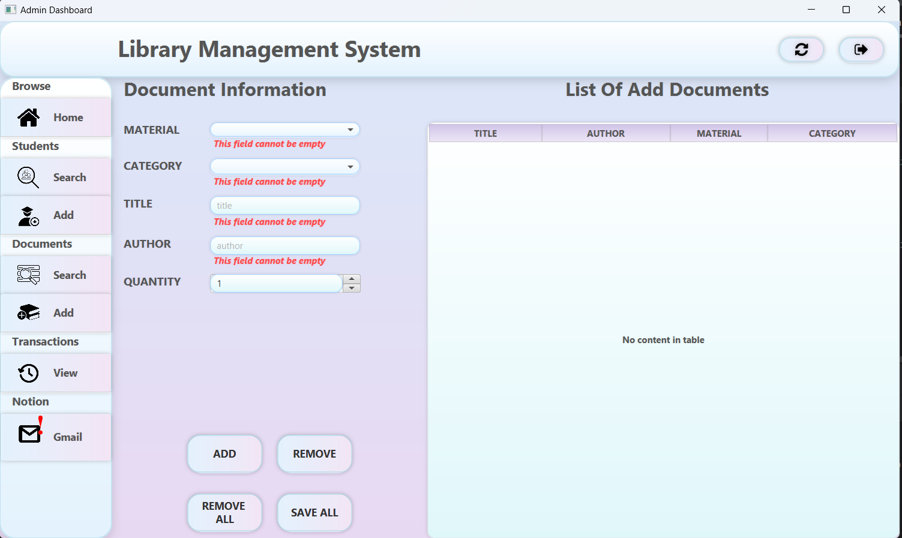

- Xem thông tin: sử dụng google API

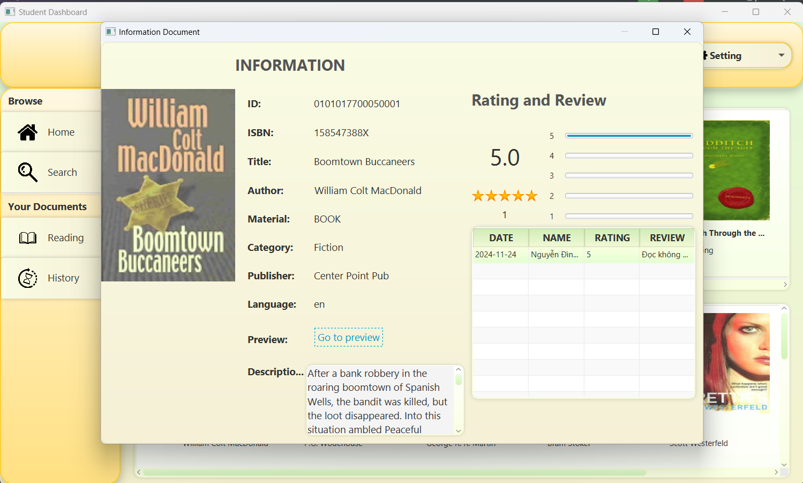

- Nhập liệu tự động bằng isbn đối với book.

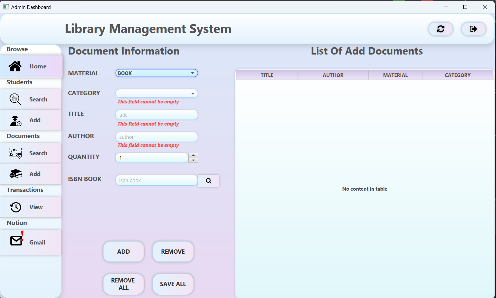

### Quản lý sinh viên
- Tìm kiếm và xóa, chỉnh sửa học sinh: 

- Thêm:

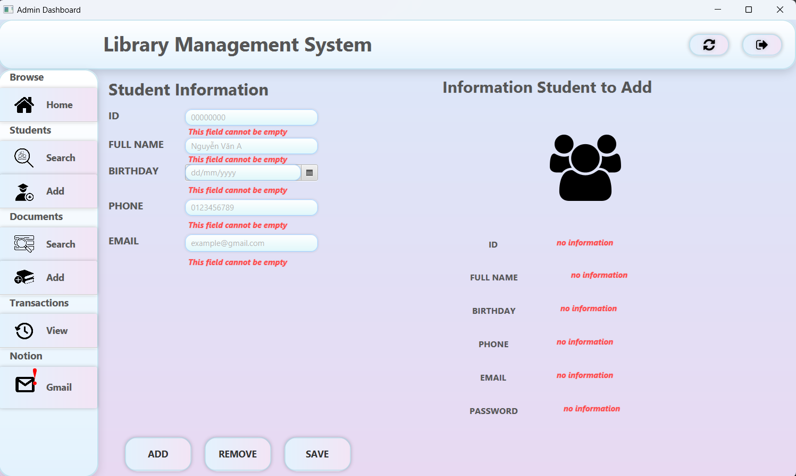

- Xem thông tin người dùng:

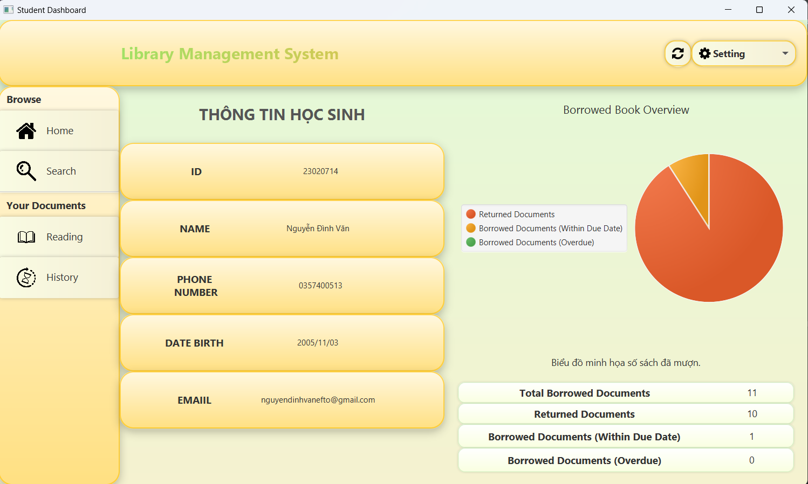

### Quản lý giao dịch của sinh viên
- Tìm kiếm, xem thông tin giao dịch, xuất PDF, xuất QR code.

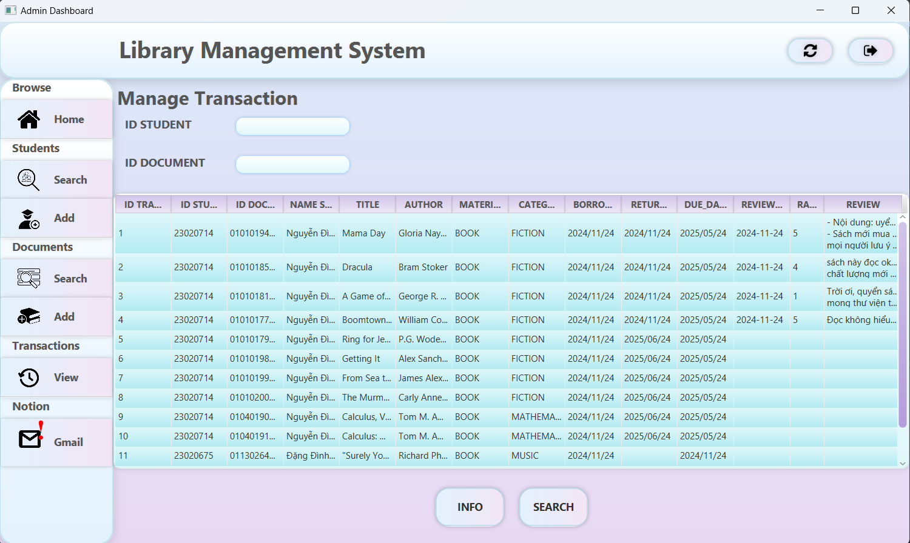

- Gửi gmail đến những sinh viên đã quá hạn trả sách.

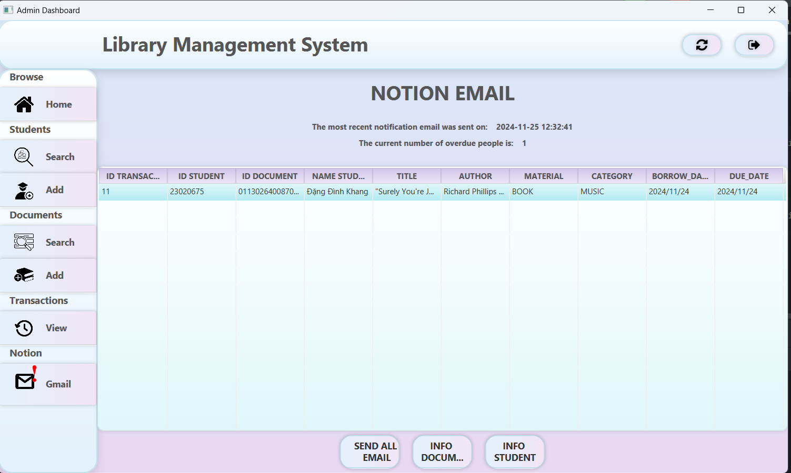

## Student
### Mượn, trả tài liệu
- Gợi ý tài liệu.(recommend theo category và theo sách mới trong thư viện)

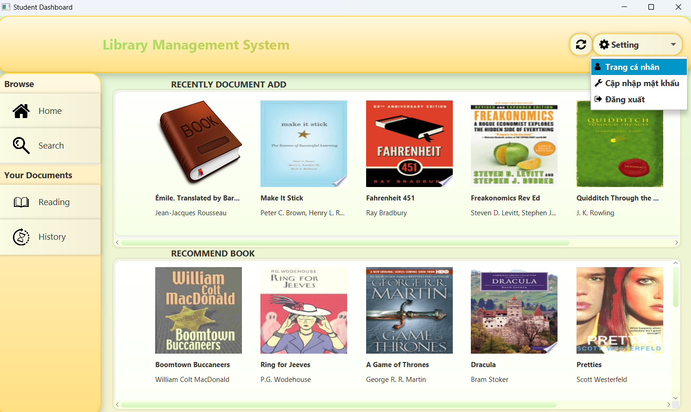

- Tìm kiếm, xem thông tin, mượn tài liệu:
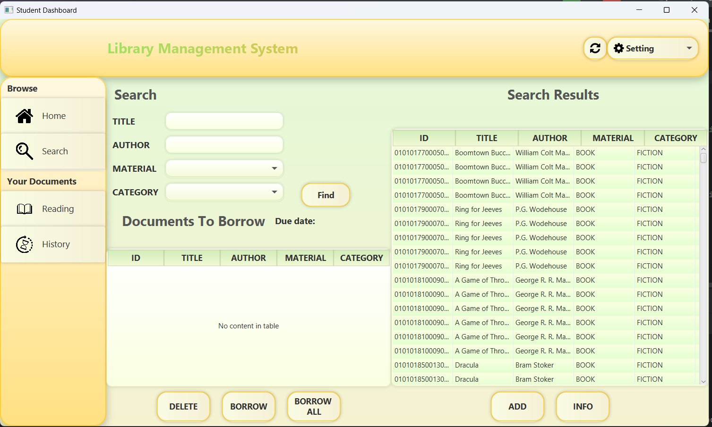

### Quản lý giao dịch của mình
- Đang mượn:
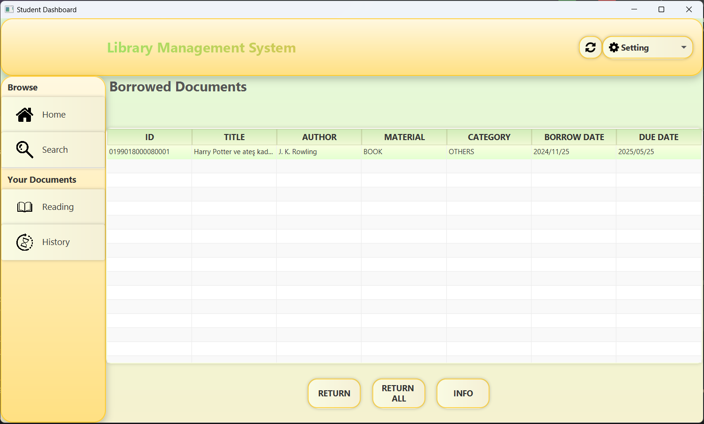

- Trả tài liệu:
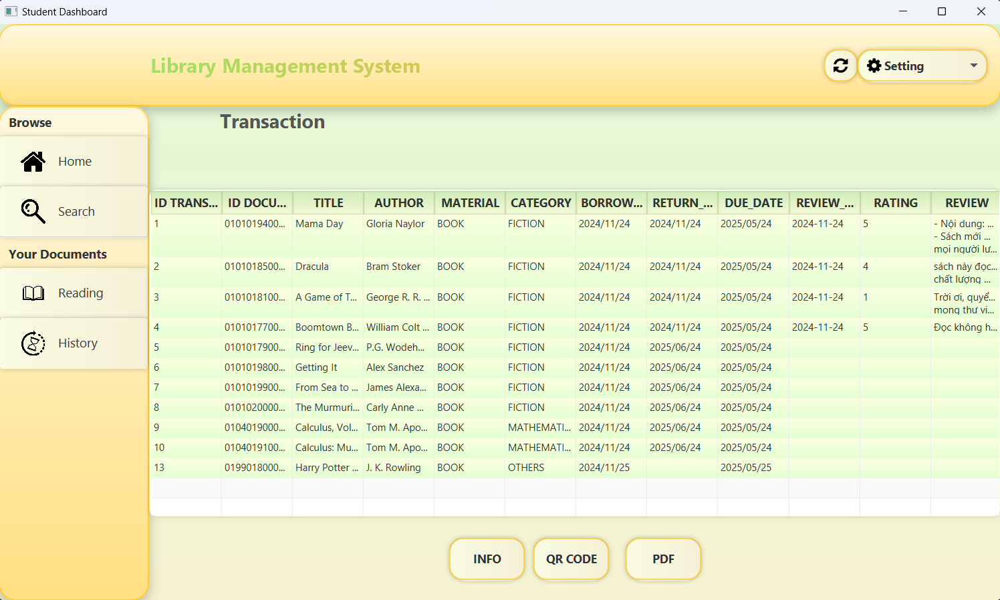

- Đánh giá tài liệu:
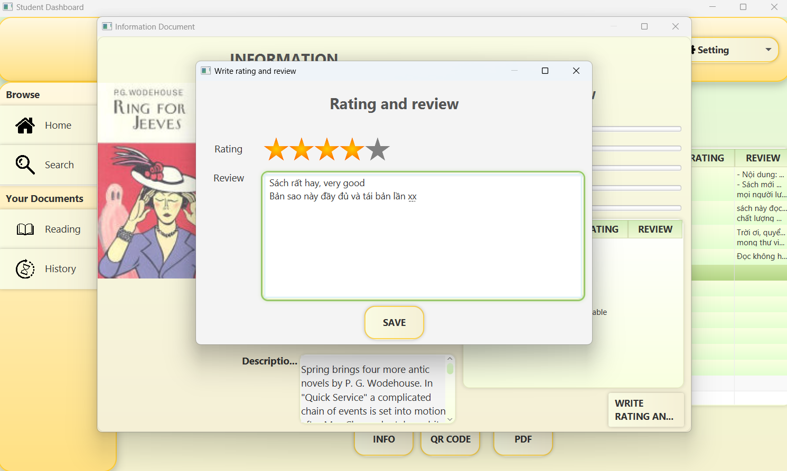

# Công nghệ sử dụng
Các kĩ thuật, công nghệ sử dụng để xây dựng ứng dụng.

## JavaFX, Scene Builder
- Sử dụng JavaFX và Scene Builder để tạo giao diện đồ hoạ cho ứng dụng.
## Google Books API
- Sử dụng Google Books API để lấy thông tin và điền tự động.
## Google Gmail API
- Sử dụng Google Gmail API để gửi mail cho những sinh viên đã đến hạn nhưng chưa trả sách.
## QR
- Tạo QR cho giao dịch
## PDF 
- Xuất file PDF.
## SQLite
- Truy vấn và quản lí tài nguyên.
# Kiến thức sử dụng
- Sử dụng các quy tắc lập trình hướng đối tượng
- Có cài đặt Junit Test
- Đặt tên đúng quy tắc lập trình
- Sử dụng đa luồng, cache để tối ưu tốc độ xử lý và trải nghiệm người dùng
- Sử dụng Design Pattern (Factory, ...), quản lý source, package, chia các class, file dễ dàng đọc, chỉnh sửa và mở rộng
